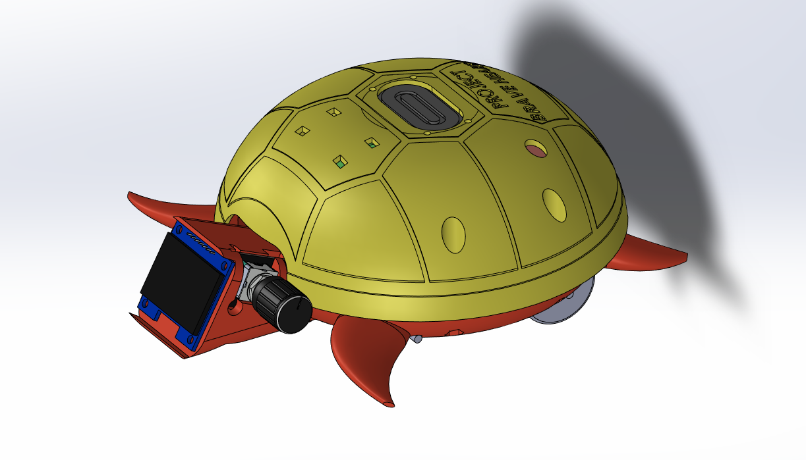

# Project Brave Heart
  
 
 Project Brave Heart is a radio alarm clock assembly. This model is turtle themed and features a wheeled drive system which activates upon the alarm being triggered - causing the turtle to run away. The main components include a custom PCB, a raspberry pi Pico, and a RDA5807M radio module. A complete description and documentation can be found in this repository.
